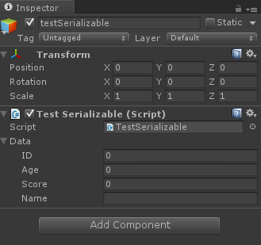

# 【OCOE筆記】序列化SerializeField介紹

##        **1、如果a是公有的序列化变量。**Getting Super Powers

（1）如果你想要在面板中看到变量a，那么用： public int a;

 （2）如果你不想在面板中看到变量a，那么用： \[HideInInspector\] public int a; 这样a可以在程序中被代码赋值，但不会在面板中看到,也不能手动设置赋值。

##  **2、如果a是私有的序列化变量，你想在面板中读取并赋值，那么用:**Getting Super Powers

```csharp
[SerializeField]
private int a;
```

##   **3、如果a是私有的序列化变量，你想在面板中读取，但是不赋值，那么用：**Getting Super Powers

```csharp
 [HideInInspector][SerializedField]
           private int a;
           public int b
           {
               get{return a;}
           }
           
```


```csharp
//然后在Editor中显示，
EditorGUILayout.LabelField("value",game.b.ToString());
```

##  **4、如果a是私有序列化变量，你不想在面板中做任何操作\(不想看到，也不想写\)，但是想要在程序中给它赋值，那么用**Getting Super Powers

```csharp
    [HideInInspector][SerializedField]
           private int a;
           public int b
           {
               get{return a;}
               set{a = value;}
           }
```

Unity Serializable 可以序列化一个类,使这个被序列化的对象在Inspector面板上显示, 并可以赋予相应的值

## EX:

```csharp
using UnityEngine;  
    using System.Collections;  
    using System;  
      
    public class TestSerializable : MonoBehaviour {  
      
        public MyData m_data;  
        [Serializable]  
        public class MyData  
        {  
      
            public int m_ID;  
            public int m_age;  
            public float m_score;  
            public string m_name;  
        }  
        // Use this for initialization  
        void Start () {  
          
        }  
          
        // Update is called once per frame  
        void Update () {  
          
        }  
    }
```












